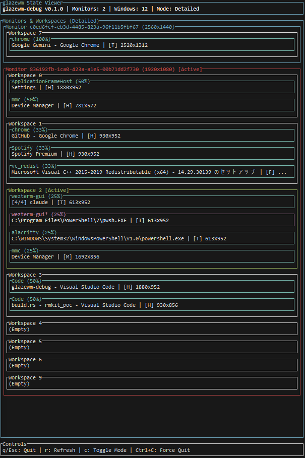

# glazewm-debug

A UNIX philosophy-based TUI debugger for visualizing glazewm window manager state.



## Quick Start

```bash
# Ensure glazewm is installed and in PATH
winget install glzr-io.glazewm

# Clone and build
git clone https://github.com/username/glazewm-debug.git
cd glazewm-debug
cargo build --release

# Run
./target/release/glazewm-debug.exe
```

## What It Does

glazewm-debug provides **real-time visualization** of your glazewm window manager state through a simple CLI+JSON approach:

- **Monitor State**: View all monitors and their configurations
- **Workspace Layout**: See workspace organization and window distribution  
- **Window Details**: Inspect individual window properties and states
- **Focus Tracking**: Identify currently focused elements

## Key Features

- ✅ **CLI+JSON Architecture**: Simple, testable, platform-agnostic
- ✅ **Real-time Updates**: 1-second polling for current state
- ✅ **Multi-monitor Support**: Handle complex display setups
- ✅ **Minimal Dependencies**: Just glazewm + JSON parsing
- ✅ **UNIX Philosophy**: Do one thing well, compose with other tools

## Requirements

- **Windows 10/11** with **glazewm 3.0.0+**
- **Rust 1.70.0+** for building from source
- glazewm must be available in PATH (`glazewm --version` should work)

## Usage

```bash
# Basic usage
glazewm-debug

# With custom refresh rate
glazewm-debug --refresh-rate 2000

# Quiet mode
glazewm-debug --quiet
```

**Keyboard Controls:**

- `q` - Quit
- `r` - Force refresh  
- `?` - Help

## Architecture

glazewm-debug uses a **CLI+JSON approach** that eliminates complex platform integrations:

```text
glazewm CLI → JSON Response → serde Parser → Domain Model → TUI Display
```

This design provides:

- **Zero IPC Dependencies**: Simple command execution
- **Platform Independence**: JSON parsing works everywhere
- **Easy Testing**: Mock with JSON fixtures
- **Future Extension**: Support other window managers via JSON mapping

## Documentation

- **[Usage Guide](docs/USAGE.md)** - Detailed CLI options and keyboard controls
- **[Display Format](docs/DISPLAY.md)** - Output formats and state indicators  
- **[API Integration](docs/API.md)** - glazewm CLI integration and JSON schemas
- **[Building](docs/BUILDING.md)** - Build instructions and troubleshooting
- **[Architecture](docs/ARCHITECTURE.md)** - Design principles and implementation
- **[Contributing](docs/CONTRIBUTE.md)** - Development workflow and guidelines

## Development

```bash
# Test-driven development workflow
cargo test          # Unit tests
cargo clippy         # Linting
cargo fmt           # Formatting
cargo build         # Development build
```

## License

MIT License

## See Also

- [glazewm](https://github.com/glzr-io/glazewm) - The target window manager
- [ArchWiki: Window Managers](https://wiki.archlinux.org/title/Window_manager) - General reference
